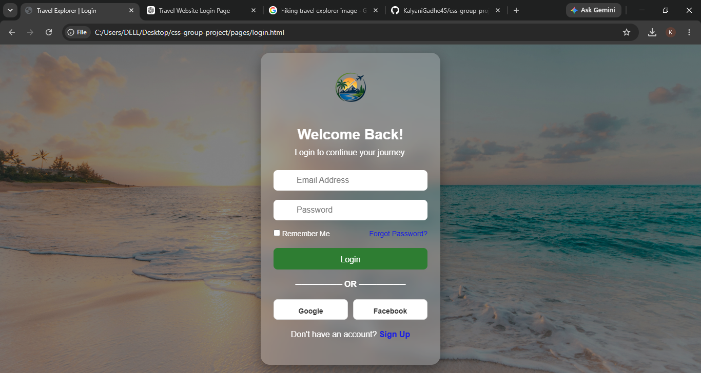
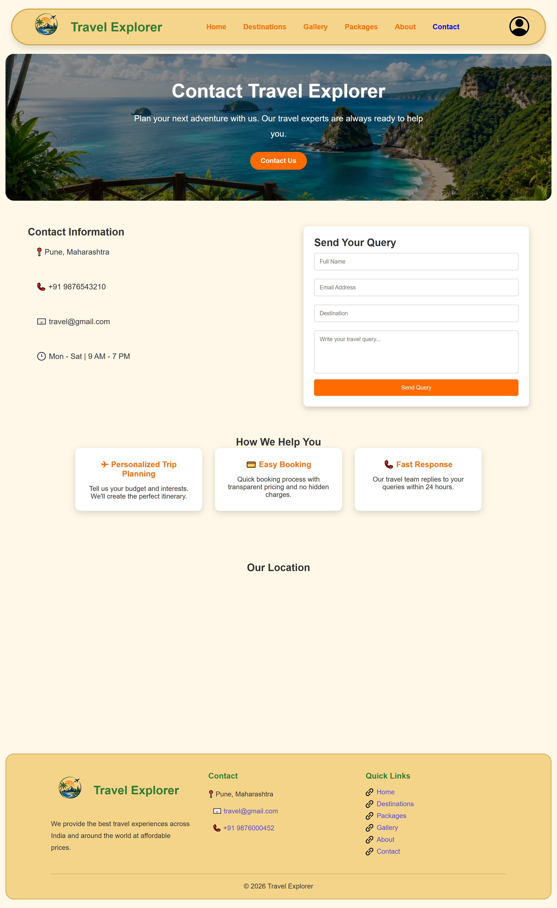

# 🌍✈️ Travel Explorer - Travel & Tourism Website

## 📌 Project Description
   Travel Ecplorer is a responsive Travel and Tourism Website developed using HTML5 and CSS3.
   It provides a seamless and responsive platform for exploring tourist destinations, travel-packages, galleries, and travel-related information with a clean and modern user experience.

## 🎯 Objectives

- To provide users with information about popular tourist destinations.
- To showcase attractive and affordable travel packages.
- To create a simple, modern, and user-friendly interface for easy navigation.

## 🛠️ Technologies Used

- HTML5
- CSS3

##  📖 Pages Implemented
1. Login Page
2. Home Page
3. Destination Page
4. Packages Page
5. Gallery Page
6. About Page
7. Contact Page

## ⚙️ How It Works
1. Open the Home Page
2. Explore featured tourist destinations.
3. Browser available travel packages.
4. view destination images in the Gallery.
5. Contact the travel agency through the Contact page.

## 🌟 Features

- Modern and Attractive user interface
- fully Responsive Desig for Mobile, Tablet, and Desktop
- Interactive home page with Hero section
- Easy navigation using Responsive Navigation Bar
- smooth hover  effects and CSS animation
- clean, user-friendly and accessible layout
- well organized content for better experience

##  🧪 Limitations
- Static front-end website
- No backend integration
- No online booking feature
- Contact form is for demonstration purposes

## 🚀 Future Scope
- Add javascript animation
- Add backend integration
- payment getway integration
- Add weather API

## 👥 Team Members
- Kalyani Gadhe
- Sakshi Nagade
- Kaweri Harinkhede
- Pranali Shende
- Anushka Gangekar
- Shubham Sharnagate
- Manoj Toche

## 👥 Contributors

## 📷 Project Preview
- Login Page

- Home page

- Destination Page

- Packages Page

- Gallery Page

- About Page

- Contact Page

## 📌 Note
This project is created for academic and competition purposes.
 
 ### Thank you for Visiting !
**Happy Travelling ! 🌍✈️**

